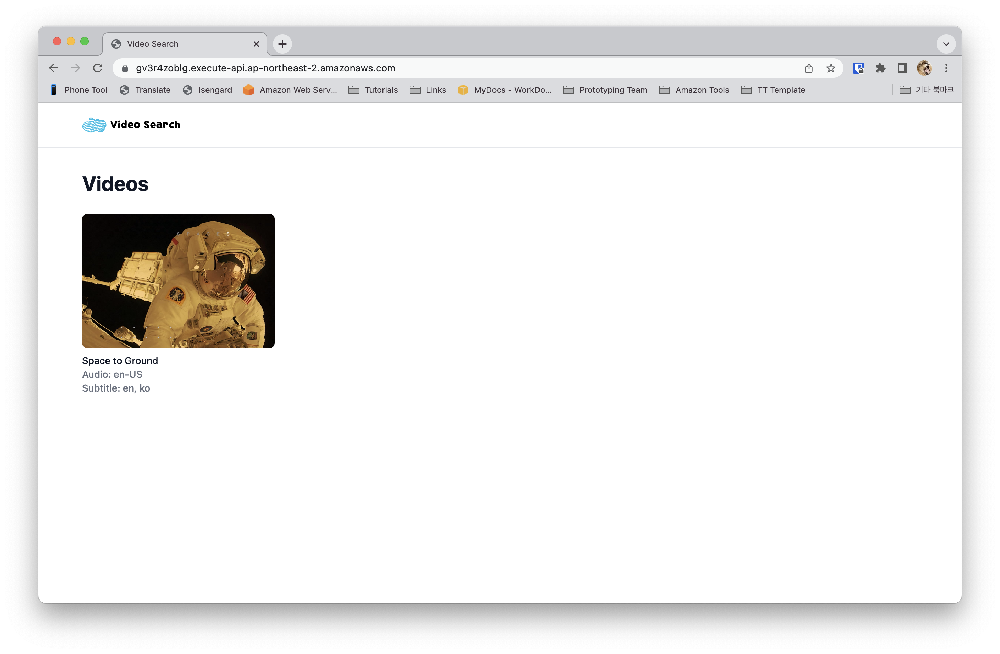
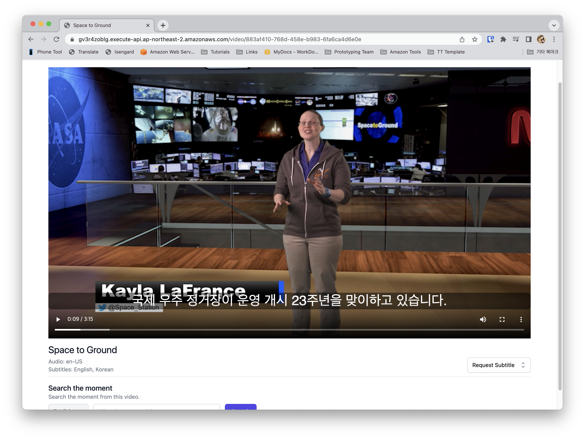
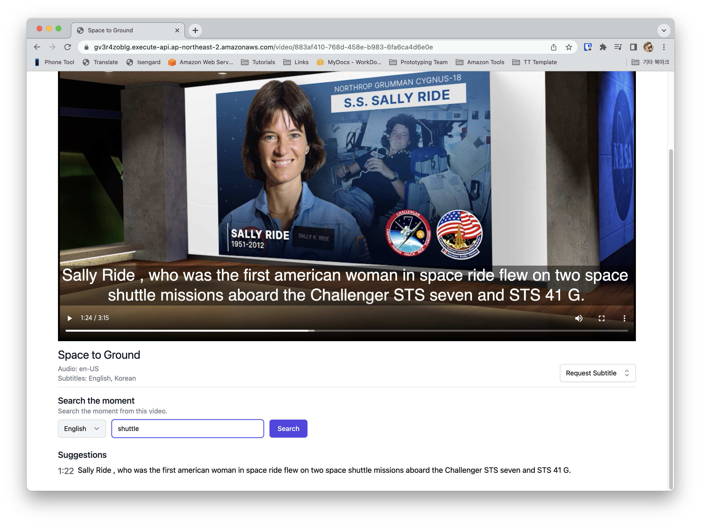
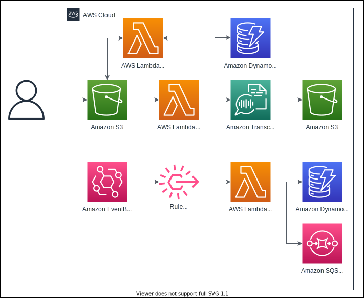
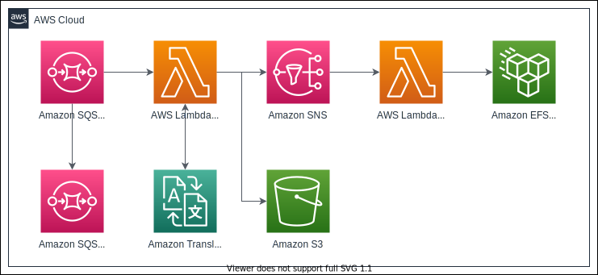
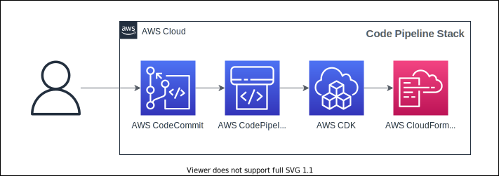
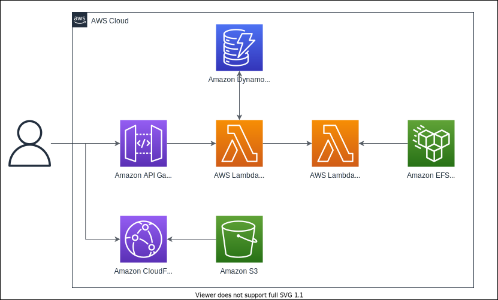

# Video Search

This repo is a sample video search app using AWS services.
You can check the demo on [this link](https://ckvt6iam3h.execute-api.us-west-2.amazonaws.com/).

## Features

- Transcribing Video and generate subtitle.
- Translate subtitle and generate subtitle.
- Search subtitle and jump to selected part of the video.

## Requirements

- [Rust](https://www.rust-lang.org/) 1.56.0 or higher
- [cargo-lambda](https://github.com/cargo-lambda/cargo-lambda)
- [Zig](https://ziglang.org/) for cross-compilation (cargo-lambda will prompt you to install it if it's missing in your host system)

## Screenshots






## Architecture

### Transcribe


### Generate Subtitle (VTT)


### Code Pipeline


### Demo App


## CDK

```bash
# install cdk
$ npm i aws-cdk

# bootstrap cdk
$ cdk bootstrap --cloudformation-execution-policies arn:aws:iam::aws:policy/AdministratorAccess aws://<account>/<region>

# if you want to use aws credential profile
$ cdk bootstrap --profile <your profile> --cloudformation-execution-policies arn:aws:iam::aws:policy/AdministratorAccess aws://<account>/<region>
```

## Deploy

### FFmpeg
This repo uses ffmpeg for extracting thumbnail image from source video. If you want to use this, you have to get the binary from the web.
I prepared the script.
```bash
$ nx run infra:ffmpeg

# The binary must to commit and push codecommit repository
$ git add -A
$ git commit -m "fix: add ffmpeg binary"
```

```bash
# build infra packages
# it depends rust packages, So you have to prepare rust environment.
$ nx build infra

# on packages/infra
# aws credential setup required.
$ cdk deploy PipelineStack

# or use profile
$ cdk deploy PipelineStack --profile <your profile>

# After deploying the stack, then the CodeCommit repo will be created.
# If you want to deploy this app, you have to push this repo to the CodeCommit repo.
# If you use 
$ git remote add codecommit <CodeCommit-Repo>
$ git push codecommit main
```

## Usage
Just upload video file to s3 that is generated by CDK. Then the video will appear on Demo app.
Video file s3 key must follow the following structure.

```
video/myvideo.en-US.mp4
```
- "video" is s3 key prefix for upload to s3. Only the video that include `video` prefix will be triggered by lambda.
- "myvideo" will be the title.
- "en-US" is language code that used by transcribe. Refer this [link](https://docs.aws.amazon.com/transcribe/latest/dg/supported-languages.html). 
- "mp4" is the file's extention. currently only mp4 and mov are supported.

You can access on demo app through the endpoint of deployed api gateway.

## Search Engine
This sample use [tantivy](https://github.com/quickwit-oss/tantivy) for searching subtitle.
In particular, Among non-Latin languages, Korean is only supported (I used [this](https://github.com/lindera-morphology/lindera-tantivy)).

## Security

See [CONTRIBUTING](CONTRIBUTING.md#security-issue-notifications) for more information.

## License

This library is licensed under the MIT-0 License. See the LICENSE file.

